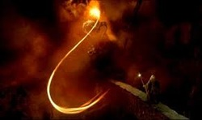

# Fiery Whip of BALROG

_BALROG's fiery whip, which he used to pull Gandalf off the Bridge of Khazad-Dum. So the whip sort of improves BALROG's capabilities...__

Exploring effective area corrections of Fermi/GBM NaI detectors using BALROG (, ) and , the master of Balrog.
For modelling and fitting  and  are used.

__Goal:__ Accounting for different detection efficiencies of the NaI detectors, which area most likely the cause of systematic uncertainty on BALROG's current localizations.

